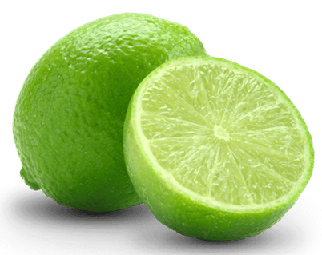

# pawamoy

## 🪐 Hello world

Hi, I'm Timothée Mazzucotelli.
I develop open-source software, primarily Python tools and libraries.
I do this full time: I earn my keep through [sponsorships](https://github.com/sponsors/pawamoy)
from individual users and companies,
which is what makes these projects sustainable
and gives you a chance to use them.

You can say hello to me on
[Mastodon](https://fosstodon.org/@pawamoy),
[X](https://x.com/pawamoy),
[LinkedIn](https://www.linkedin.com/in/tmazzucotelli/),
[Matrix](https://matrix.to/#/@pawamoy:matrix.org),
[Discord](https://discordapp.com/users/393362331494776833),
[Telegram](https://t.me/pawamoy),
[Signal](https://signal.me/#eu/NBYY34FhSLL4A54k52+pI2It8qVBQy/pYDQBt+qxNej1IHVuqppNvKURTQuwrTXP),
or by email at dev@pawamoy.fr 📫 👋🏼

## 🌱 Features

- 🎓 learned computer science at a french university
- 🐍 some years of experience in development, particularly with Python
- 🎠 really enjoy sharing code and contributing to other projects
- 👔 working full time on open-source projects
  (following a [sponsorware strategy](https://pawamoy.github.io/insiders))

## 🌲 Projects

<table>
    <tbody>
        <tr>
            <td>
                
<strong>mkdocstrings</strong>

                
            </td>
            <td>
                
<strong>copier-uv</strong>

                
            </td>
            <td>
                
<strong>aria2p</strong>

                
            </td>
        </tr>
    </tbody>
</table>

## See also

Here is some green lemon:

