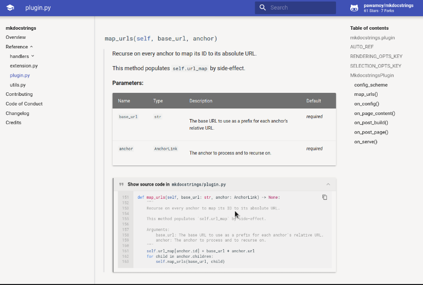

<h1 align="center"><em>¤ pawamoy</em></h1>

<em>Timothée Mazzucotelli</em>

    
    
    

---

## :heavy_check_mark: Features

- learned computer science at a french university
- some years of experience in development, particularly with Python
- really enjoy sharing code and contributing to other projects

## :factory: Projects

<table>
    <tbody>
        <tr>
            <td>
                
<strong>aria2p</strong>

                
            </td>
            <td>
                
<strong>mkdocstrings</strong>

                
            </td>
            <td>
                
<strong>copier-poetry</strong>

                
            </td>
        </tr>
    </tbody>
</table>

<h2 align="center">
    More:
    <a href="https://pawamoy.github.io/showcase">showcase</a>,
    <a href="https://github.com/sponsors/pawamoy">sponsors</a>.
</h2>

### :bar_chart: Stats

<!--marker-->
- Total downloads: 1,552,871 
- Downloads/month: 152,950 
<!--end-->

<small><em>Credits to
<a href="https://simonwillison.net/2020/Jul/10/self-updating-profile-readme/">Simon Willison</a>
for the automatic updates.
</em></small>